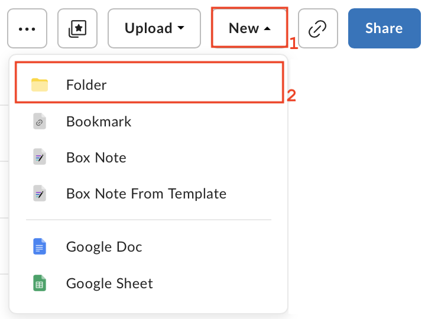
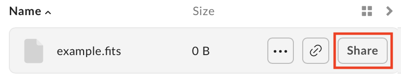
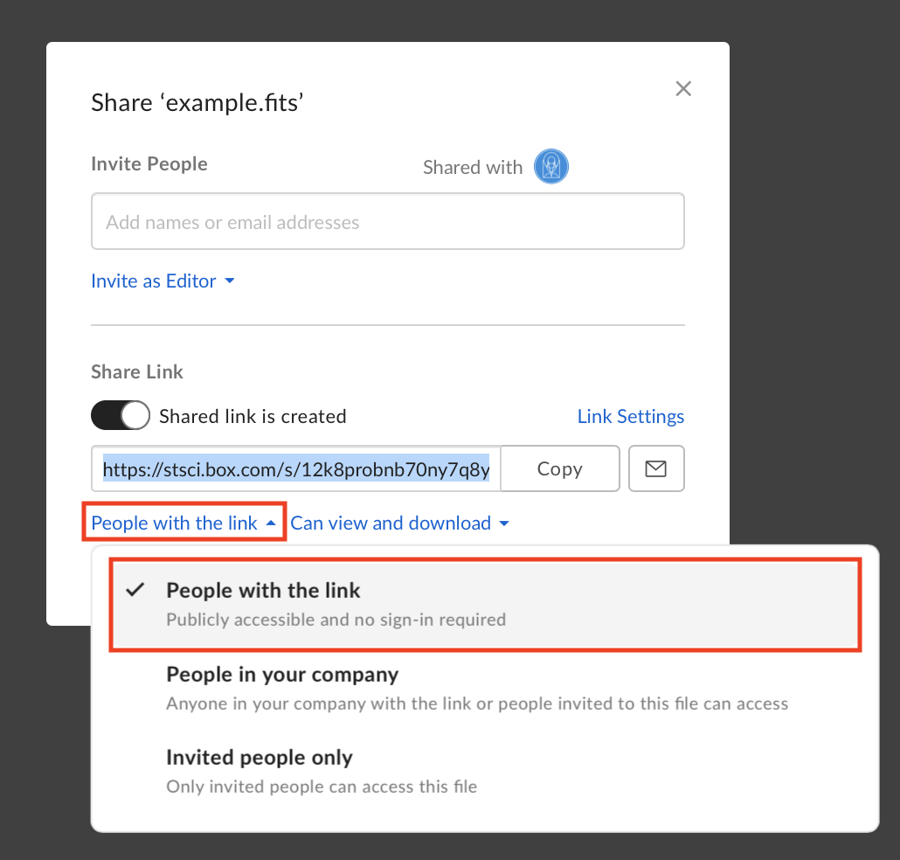

.. _Data Files:

##########
Data Files
##########

Since we will be sharing the notebooks with the astronomical community, the data analysed and visualized
in the notebooks need to be easily downloadable. As such, the JDAT team at STScI has set up a Box folder for
distributing data products. For security reasons, we only support data files hosted on STScI's Box folder. Please follow
the guideline below on uploading and integrating your data files.

.. seealso::

    For the most up to date information on data storage at STScI, please visit the
    `STScI guidelines on data storage for notebooks. <https://github.com/spacetelescope/style-guides/blob/master/guides/where-to-put-your-data.md>`_.

Uploading Data to Box
*********************

.. important::

    In order to submit your data files, you will need a Box account. Please see the
    `Box support page <https://support.box.com/hc/en-us/articles/360044196373-The-Basics-of-Box>`_ for instructions.
    Once you have your Box account setup, contact the JDAT team for an email invite to the STScI
    `jwst-data_analysis_tools` folder. If you are not an STScI staff member, please request access in your pull request.

.. tip::

    If you have multiple files, you should put them in a `zip` file before uploading them to Box.

**Step 1: Create a New Folder**: Once you have access to the `jwst-data_analysis_tools` folder on Box,
you may create a new folder with the same name as the folder containing
your notebook and `requirements.txt` (see :ref:`GitHub Submissions` section for naming conventions).
Once the folder is created, you may upload your data files into that folder.

**Step 2: Upload Data Files**: To upload files, navigate into your the folder you created and select ``File``
under the ``Upload`` menu.

.. image:: images/box_upload.png
    :scale: 50%
    :align: center

**Step 3: Sharing Settings**: The files you uploaded should be shareable to the public. For each file you uploaded and
hover over the file name. Select the ``Share`` button to open the sharing options.

Once the sharing dialog opens up, make sure the ``Shared Link`` radio button is toggled on and
that the ``People with the link`` option is selected.

Once the file is shared, a blue link icon will appear next to the name of the file.

.. note::

    Make sure the folder is also being shared and that the ``People with the link`` option is selected. You can check
    by clicking the blue share button on the upper right corner of the page. You must be viewing the folder you created
    before clicking the button.

    .. image:: images/box_share_folder_button.png
        :scale: 50%
        :align: center

**Step 4: Updating Data Files**: You can upload new versions of your data on Box by right clicking the name of your file
and clicking ``Upload New Version``:

.. image:: images/box_update_file.png
    :scale: 50%
    :align: center

Box URLs in Notebooks
*********************

.. important::

    Files on the STScI Box are assigned a human readable link and we request that notebook leads use this URL in their Notebooks.

Once your files are uploaded, you can use them in your notebooks via URL link.
The human readable URL has the following format::

    https://data.science.stsci.edu/redirect/JWST/jwst-data_analysis_tools/name_of_your_folder/name_of_file.extension

For example, lets say you created a folder called `example_folder` and added a file named `example.fits`, the URL would be::

    # The path on box:
    jwst-data_analysis_tools > example_folder > example.fits

    # The URL:
    https://data.science.stsci.edu/redirect/JWST/jwst-data_analysis_tools/example_folder/example.fits

You should now be able to use this URL just like any path in your notebook. In the example above, we can open the fits
file using astropy as follows:

.. code-block:: Python

    from astropy.io import fits

    data_url = "https://data.science.stsci.edu/redirect/JWST/jwst-data_analysis_tools/example_folder/example.fits"
    hdu_list = fits.open(data_url)

.. note::

    If you are not able to open your file using URLs, please let the team know or leave a developer note in your notebook.

If you have to download a file or have a `zip` file, you can use the following code to download the file
(and unzip for `zip` files) inside the notebook:

.. code-block:: Python

    import os

    # If the example dataset has already been downloaded, comment out these lines:
    import zipfile
    import urllib.request

    boxlink = "https://data.science.stsci.edu/redirect/JWST/jwst-data_analysis_tools/example_folder/example.zip"
    boxfile = './example.zip'  # Specify output path and file name of downloaded file

    # Download file
    urllib.request.urlretrieve(boxlink, boxfile)

    # Unzip .zip file
    zf = zipfile.ZipFile(boxfile, 'r')
    zf.extractall()

This example will download and extract data files into the same directory containing the running notebook.
Since how you zip your files determines the directory structure of the unzipped data,
please use your code to download the files and check to make sure the paths in your notebook match the file structure
of your unzipped data.
