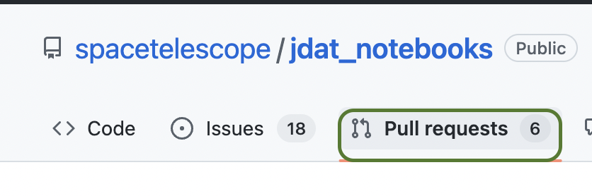
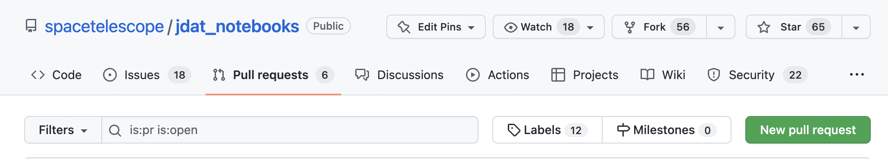
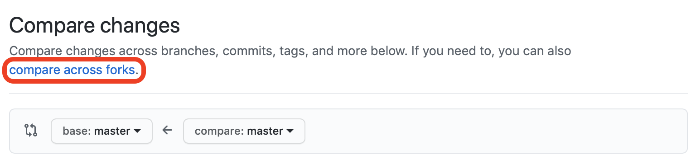
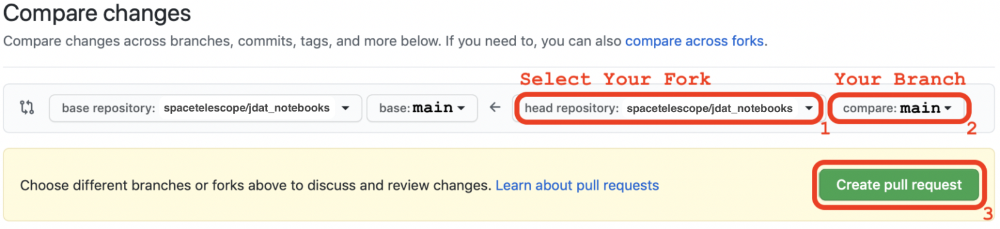
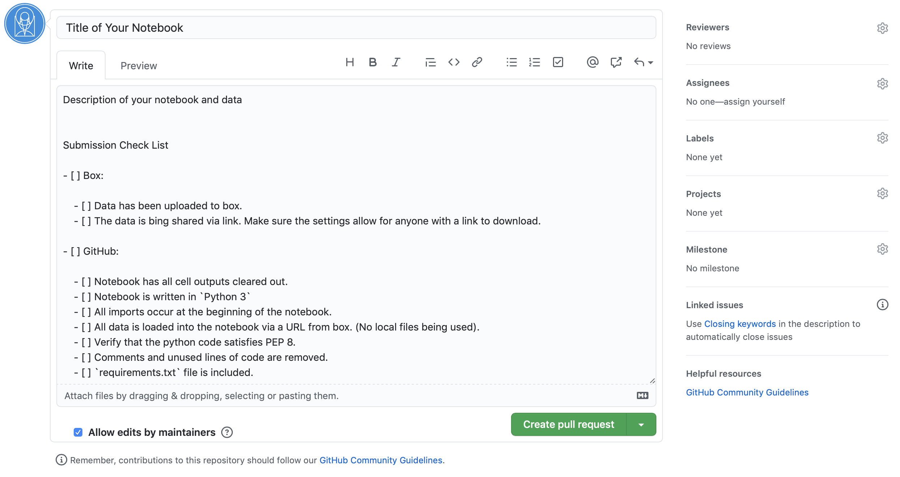

.. _GitHub PR:

##########################
Making a Pull Request (PR)
##########################

.. _jdat_notebooks: https://github.com/spacetelescope/jdat_notebooks

**Step 1: Open PR Tab on GitHub**

To create a pull request, navigate to the STScI `jdat_notebooks`_ repository on GitHub and click on the
`Pull Request`:

**Step 2: Click New PR Button**

**Step 3: Compare Across Forks**

**Step 4: Select Your Fork and Branch**

Use the drop down menu to select your fork and branch. If you can not find your branch, first try to refresh the page.
If you still can not find your branch, something probably went wrong in the :ref:`Git and GitHub Workflow <git-workflow>` section.

.. note::

    Make sure the `base repository` (left side) is set to the `spacetelescope/jdat_notebooks` and `main` branch.

**Step 5: Write a Description and Create PR**

Once the PR form pops up, fill in the title with the name of your notebook or project. In the description box,
leave a description of your notebook and the data it uses.

.. tip::

    If you copy and paste the checklist in the :ref:`Check List` section, it will render as a checklist with
    radio buttons you can toggle any time.

.. _Updating Your PR:

**Step 6: Updating Your PR**

Once the PR is created, you can update it by pushing new changes to **your fork**. This means that you can simply follow
the steps described in the :ref:`Git and GitHub Workflow` section and GitHub will automatically update your PR to reflect the changes.

.. seealso::

    For more information on making pull request visit the
    `GitHub PR documentation <https://docs.github.com/en/github/collaborating-with-issues-and-pull-requests/creating-a-pull-request>`_