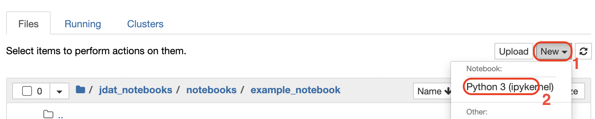

.. _Jupyter Notebooks:

#################
Jupyter Notebooks
#################

Please see the :ref:`Development Procedure` section for notebook development guidelines.

.. seealso::

    For detailed instructions on formatting notebook, please visit the
    `STScI notebook style guide. <https://github.com/spacetelescope/style-guides/blob/master/guides/jupyter-notebooks.md>`_

Installation
************

For instructions on how to install Jupyter notebooks, please visit the
`Jupyter Installation page <https://jupyter.org/install>`_.

We also strongly recommend using an environment managing tool for keeping track of dependencies and
preventing conflicts.  Options include the `venv` package and `pip` tools in the python standard library, or the 
 `Conda <https://docs.conda.io/projects/conda/en/latest/index.html>`_ tool combined with the `conda-forge`
 package index. If you need instructions on how to setup Conda, please see the Conda's
`Getting Started <https://docs.conda.io/projects/conda/en/latest/user-guide/getting-started.html>`_ documentation.

.. important::

    Please note that all JDAT related code is written `Python 3`; `Python 2` is not supported.

Starting a Notebook
*******************

In your terminal, ``cd`` into the directory you would like to work in and run ``jupyter notebook``.
If a web browser does not pop up, use the URL in the terminal output to open the Jupyter home page.

Creating a New Notebook
***********************

To create a new notebook, navigate to the directory you would like to work in and select the `Python 3` option
under the `new` menu item:

Markdown
********

"Markdowns" are used to add supporting literature to notebooks. To convert a cell to markdown,
select it with your courser and select markdown in the cell type drop down menu.

.. image:: images/notebook_markdown.png
    :scale: 50%
    :align: center

Once the cell converts to a markdown cell, you can enter your text and equations. If you have links to an image, you
can embed them and they will be rendered when you run the cell.
**After you are done editing, make sure to run the cell (Shift + Enter) to render the markdown**

.. seealso::

    See Adam Pritchard's `markdown cheatsheet <https://github.com/adam-p/markdown-here/wiki/Markdown-Cheatsheet>`_
    for tips and instructions.

Developer Notes
***************

Developer notes are used to leave notes or feedback for the JDAT developers.
A developer note should be a part of the notebook itself and should be a
single `markdown`_ cell. That cell should begin with the text ``*Developer Note:*``.
For example:

.. code-block::

    *Developer Note:*
    Creating the spectrum above is a bit complicated, and it would improve the workflow if there was a single
    simple function that just did `spec = simulate_jwst_spectrum(a, b)`.

Clearing Notebook Outputs
*************************

All cell outputs of the notebook should be cleared before opening or updating a pull request. This is because fully
rendered notebooks with figures can take up large amounts of storage space. Please make sure your results are
reproducible (you do not need the outputs) because clearing the notebook is not revisable. To clear notebook cell outputs,
please click ``Kernel`` in the Jupyter menu and select ``Restart & Clear Output``.
After the notebook restarts, make sure to save the notebook before closing and submitting it.

.. image:: images/notebook_restart_and_clear_outputs.png
    :scale: 50%
    :align: center

Multiple Notebooks
******************

If you have multiple notebooks that need to run in a specific sequence, please name the notebooks
by prepending a number before each notebook title according to the sequence (up to 99 notebooks allowed). For example::

    jdat_notebooks
    └── notebooks
        └── example_folder
            ├── 01_generate_simulated_data.ipynb
            ├── 02_run_calibration_pipeline.ipynb
            ├── 03_data_analysis.ipynb
            └── requirements.txt

Pep-8 Guideline
***************

Please see STScI's `Python Guideline <https://github.com/spacetelescope/style-guides/blob/master/guides/python.md>`_ and
the official `Pep-8 Guideline <https://www.python.org/dev/peps/pep-0008/>`_ for more information.

.. seealso::

    - `STScI notebook style guide <https://github.com/spacetelescope/style-guides/blob/master/guides/jupyter-notebooks.md>`_

    - `STScI Python style guide <https://github.com/spacetelescope/style-guides/blob/master/guides/python.md>`_